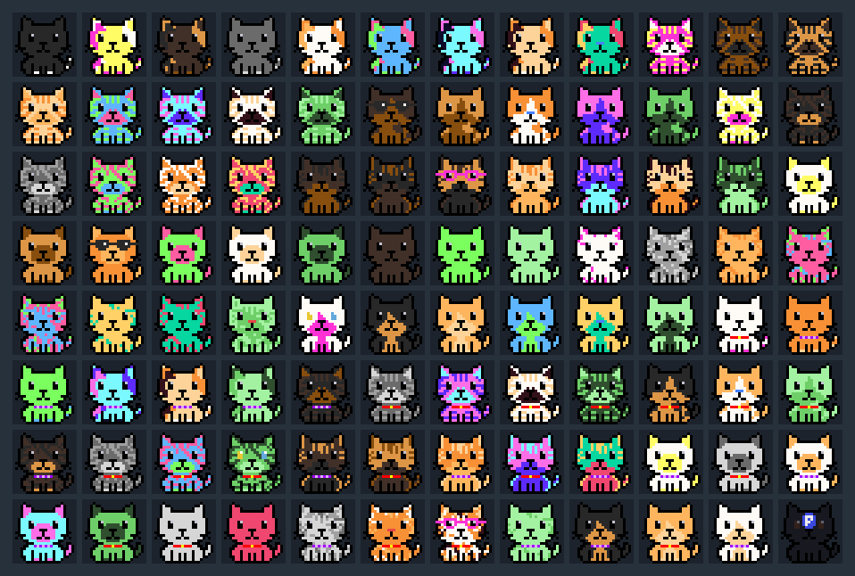

# CoreCats 🐱
A fully on-chain NFT project on Core Blockchain.

## Preview

Representative sample grid from the current 1,000-cat artwork review set.

## Project Docs
- [Implementation Source Mapping](docs/IMPLEMENTATION_SOURCE.md)
- [Final 1000 Trait Schema](docs/FINAL1000_TRAIT_SCHEMA.md)
- [Core Cats ETH: Project Status](https://github.com/Akiyosih/core-cats-eth/blob/main/docs/PROJECT_STATUS.md)
- [Core Cats ETH: Core Migration Roadmap](https://github.com/Akiyosih/core-cats-eth/blob/main/docs/ROADMAP_CORE_MIGRATION.md)
- [Core Cats ETH: Core Blockchain Work Procedure](https://github.com/Akiyosih/core-cats-eth/blob/main/docs/WORK_PROCEDURE_CORE_BLOCKCHAIN.md)
- [Core Cats ETH: ADR-0001 ETH-first Strategy](https://github.com/Akiyosih/core-cats-eth/blob/main/docs/DECISIONS/ADR-0001-eth-first-strategy.md)
- [Core Cats ETH: ADR-0002 Randomness Strategy](https://github.com/Akiyosih/core-cats-eth/blob/main/docs/DECISIONS/ADR-0002-randomness-strategy.md)

## Mirrored Final Artifacts
- `manifests/base1000_no_rare_latest.json`
- `manifests/final1000_review_manifest_v1.json`
- `manifests/final_1000_manifest_v1.json`
- `manifests/final_1000_validation_v1.json`
- `manifests/final_1000_trait_summary_v1.json`
- `manifests/final_1000_preview_consistency_v1.json`
- `manifests/trait_display_labels_v1.json`

- 🧱 Built with Solidity for the Core ecosystem
- 🎨 Features 100% on-chain SVG artwork
- 🔐 KYC-gated mint is a target feature (final integration path under validation)
- 📦 Open-source, transparent, and rugpull-resistant

## License
This project is licensed under the MIT License.

## 📜 Project Specification / プロジェクト仕様書
---

### English

**Project Name**: CoreCats  
**Blockchain**: Core Blockchain  
**Token Standard**: CBC-20 / ERC721-compatible  
**Total Supply**: **1,000 (immutable)**  
**Mint Limit per User**: **3 (per KYC-verified address, immutable)**  
**Artwork Specs**: **24×24 SVG pixel art** / Fully on-chain storage / Unique generation via part combination  
**Mint Condition**: KYC-gated mint planned (final integration path TBD)  
**Mint Price**: **Free (no primary sale fee)**  
**Secondary Sale Fee**: **None**  
**Transparency Policy**: All contract code, generation logic, and deployment history will be publicly available on GitHub  

**Technical Policy**:
1. **Randomness Method**: `commit-reveal + future blockhash + lazy Fisher-Yates`  
   - Same algorithm on Sepolia rehearsal and Core production path  
   - Assignment process is designed to be replay-verifiable from on-chain data  
   - `RandomSource` abstraction keeps future VRF migration possible without NFT semantic changes  
2. **Immutability**: Total supply and per-user limit fixed at the contract level  
3. **Trust & Openness**:  
   - Full source code and art parts published on GitHub  
   - Open review process instead of formal audit (cost-saving)  

**Development Steps**:
1. **MVP Smart Contract**:  
   - Implement minimal `mint()`, `generateSVG()`, `tokenURI()` functions  
   - Use pre-commitment + `blockhash` randomness  
2. **Testnet Verification**:  
   - Deploy & mint on Devin or Koliba Testnet  
3. **Mainnet Deployment**:  
   - Store all data fully on-chain  
   - Publish code, parts, and hashes on GitHub  

**Operation Policy**:
- Fully free project, no secondary sale royalties  
- No operational control to change total supply or core specifications after deployment

---

### 日本語

**プロジェクト名**: CoreCats  
**ブロックチェーン**: Core Blockchain  
**トークン規格**: CBC-20 / ERC721互換  
**総発行枚数**: **1,000体（不可変）**  
**ユーザーあたりミント上限**: **3体（KYC認証済みアドレスごと、不可変）**  
**画像仕様**: **24×24 SVGドットアート** / 全てオンチェーン保存 / パーツ組合せで唯一性生成  
**ミント条件**: KYC制限ミントを予定（最終的な連携方式は後日確定）  
**ミント価格**: **無料（一次販売手数料なし）**  
**二次流通手数料**: **なし**  
**公開方針**: コントラクト、生成ロジック、デプロイ履歴をGitHubで全公開  

**技術方針**:
1. **乱数生成方式**: `commit-reveal + future blockhash + lazy Fisher-Yates`  
   - SepoliaリハーサルとCore本番で同一アルゴリズムを採用  
   - オンチェーンデータから第三者が再計算・検証できる設計  
   - 将来VRFが確定した場合は`RandomSource`抽象で差し替え可能（NFT意味論は維持）  
2. **不可変設定**: 総発行枚数・ユーザー上限をコントラクトで固定  
3. **信頼性・オープン性**:  
   - ソースコードとアートパーツをすべてGitHubで公開  
   - 外部監査は省略し、オープンレビュー方式でコスト削減  

**開発ステップ**:
1. **MVPスマートコントラクト作成**:  
   - `mint()`・`generateSVG()`・`tokenURI()` の最低限機能を実装  
   - 乱数生成は事前コミット＋`blockhash`  
2. **テストネット検証**:  
   - DevinまたはKoliba Testnetでデプロイ＆ミント  
3. **本番デプロイ**:  
   - 全データをオンチェーンに書き込み  
   - コード・パーツ・ハッシュをGitHubで公開  

**運営ポリシー**:
- プロジェクトは完全フリー、二次流通ロイヤリティなし  
- デプロイ後は総発行数や主要仕様を変更できないように設計
